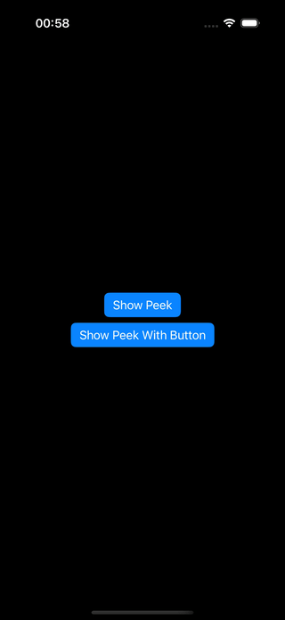

[](https://swiftpackageindex.com/cembaykara/PeekDialog) [](https://swiftpackageindex.com/cembaykara/PeekDialog)
# 📦 PeekDialog 

A lightweight, fully customizable SwiftUI toast notification and banner component for iOS, macOS, watchOS, and visionOS. Display temporary, non-intrusive dialogs that automatically dismiss or can be swiped away. Perfect for showing success messages, error notifications, network status updates, and other transient alerts in your SwiftUI apps.

 <p align="center">
  
</p>

## Why PeekDialog?

PeekDialog provides a native SwiftUI solution for toast notifications and banners that feels right at home in your app.

PeekDialog is:
- **Fully Customizable**: Use `.plain` style for complete control, or choose from built-in glass effects - customize backgrounds, colors, shapes, and layouts to match your app perfectly
- **iOS 15**: Supports the latest iOS 26+ glass effects while maintaining iOS 15+ compatibility
- **Easy to Use**: Familiar API similar to `.sheet()` and `.alert()` modifiers

Perfect for developers who want beautiful, fully customizable notifications.

## ✨ Features

- 🎨 **Plain Style for Full Control**: Use `.dialogStyle(.plain)` to remove all default styling and create completely custom toast notifications with your own backgrounds, colors, and layouts
- ⏳ **Auto-Dismissal**: Choose from predefined durations (short: 2s, medium: 5s, long: 8s) or set custom timing with `.custom(seconds:)`
- ️ **Customization**: Use any SwiftUI view as content - buttons, images, custom layouts, anything

## 🔧 Installation

##### Swift Package Manager
 You can install the PeekDialog via Swift Package Manager.
 - In Xcode, add the PeekDialog by navigating to **File > Add Package Dependencies**
 - And enter the GitHub link: ```https://github.com/cembaykara/PeekDialog.git```

##### With Packages.swift

Add PeekDialog to your `Package.swift`:

```swift
dependencies: [ 
	.package(url: "https://github.com/cembaykara/PeekDialog.git", from: "1.0.0")
]
```

## 🚀 Usage

### Basic Usage with Boolean Binding

Present a dialog using a boolean binding, just like you would with `.sheet(isPresented:)`:

```swift
import SwiftUI
import PeekDialog

struct ContentView: View {
    @State private var showDialog = false

    var body: some View {
        VStack {
            Button("Show Success Message") {
                showDialog = true
            }
        }
        .peekDialog(isPresented: $showDialog, dismissDelay: .medium) {
            HStack {
                Image(systemName: "checkmark.circle.fill")
                    .foregroundColor(.green)
                Text("Operation completed successfully!")
                Spacer()
            }
            .padding()
        }
    }
}
```

### Using Optional Item Binding

Bind the dialog to an optional item for automatic presentation when the item becomes non-nil:

```swift
struct ContentView: View {
    @State private var errorMessage: String? = nil

    var body: some View {
        VStack {
            Button("Simulate Error") {
                errorMessage = "Network request failed"
            }
        }
        .peekDialog(with: $errorMessage, dismissDelay: .long) { message in
            HStack {
                Image(systemName: "exclamationmark.triangle.fill")
                    .foregroundColor(.red)
                Text(message)
                Spacer()
            }
            .padding()
        }
    }
}
```

##### Custom Duration

You can define a duration by using `PeekDialogDelay.custom(seconds:)`.

```swift
	.peekDialog(with: $myItem, dismissDelay: .custom(seconds: 1.25)) { item in
		/* ... */
	}
```

##### Placement

Pass `placement` to show the dialog at the top, center, or bottom. Default is `.top`.

```swift
	.peekDialog(isPresented: $showDialog, dismissDelay: .medium, placement: .bottom) {
		/* ... */
	}
```

##### Custom Dialog Styles

You can customize the appearance of your dialogs using the `.dialogStyle(_ style:)` modifier, similar to how Apple's `.buttonStyle()` modifier works. PeekDialog comes with built-in `.glassRegular` and `.glassClear` styles for iOS 26+, or you can create your own custom styles.

```swift
struct ContentView: View {
    @State private var showDialog = false

    var body: some View {
        VStack {
            Button("Show Glass Dialog") {
                showDialog = true
            }
        }
        .peekDialog(isPresented: $showDialog) {
            VStack {
                Text("This dialog has a glass effect!")
            }
            .dialogStyle(.glassRegular)
        }
    }
}
```

##### Creating Your Own Custom Dialog Style

Just like creating custom button styles with `ButtonStyle`, you can create custom dialog styles by conforming to the `DialogStyle` protocol. This gives you complete control over the appearance of your dialogs:

```swift
// Define your custom style
struct GradientDialogStyle: DialogStyle {
    func makeBody(configuration: Configuration) -> some View {
        configuration.passedContent
            .frame(maxWidth: 450, minHeight: 64)
            .background {
                RoundedRectangle(cornerRadius: 24)
                    .fill(
                        LinearGradient(
                            colors: [.blue, .purple],
                            startPoint: .leading,
                            endPoint: .trailing
                        )
                    )
            }
            .shadow(color: .blue.opacity(0.3), radius: 10, x: 0, y: 5)
    }
}
```

- You can apply any SwiftUI modifiers: backgrounds, shapes, shadows, animations, etc.

> **⚠️ Warning**  
> The style is applied **inside** the `peekDialog` closure, not on the view with the modifier. Make sure to call `.dialogStyle()` on the content view within the closure.
>>```swift
>>    .peekDialog(isPresented: $showDialog) {
>>            VStack {
>>                Text("This dialog has a glass effect!")
>>            }
>>            .dialogStyle(.glassRegular)
>>        }
>>```

##### Plain Style for Complete Customization

Use `.dialogStyle(.plain)` to remove all default styling and create fully custom banners with your own background, colors, and layout. This gives you complete control over the appearance:

```swift
struct ContentView: View {
    @State private var showToast = false

    var body: some View {
        VStack {
            Button("Show Custom Toast") {
                showToast = true
            }
        }
        .peekDialog(isPresented: $showToast, dismissDelay: .short) {
            Text("Copied to clipboard")
                .font(.body)
                .foregroundColor(.white)
                .padding(.horizontal, 20)
                .padding(.vertical, 12)
                .background {
                    RoundedRectangle(cornerRadius: 20)
                        .fill(Color.black.opacity(0.8))
                }
                .dialogStyle(.plain)
        }
    }
}
```

With `.plain` style, you can customize without a custom `DialogStyle` on the go. It removes all default styling, letting you build exactly what you need!

## 📋 Common Use Cases

PeekDialog is perfect for:

- **Success Messages**: Confirm user actions like "Saved!", "Uploaded!", "Deleted!"
- **Error Notifications**: Display network errors, validation failures, or operation errors
- **Status Updates**: Show connection status, sync progress, or background task completion
- **User Feedback**: Provide immediate feedback for button taps, form submissions, or data changes
- **Information Banners**: Display important but non-blocking information
- **Temporary Alerts**: Show time-sensitive messages that don't require user interaction

The swipe-to-dismiss gesture makes it perfect for notifications that users might want to quickly dismiss, while auto-dismissal handles messages that don't require attention.

## 🤝 Contributing

Contributions are welcome! If you find a bug or have a feature request, please open an issue. If you'd like to contribute code, fork the repository and submit a pull request.

  <a href='https://ko-fi.com/F1F719XC8H' target='_blank'></a>

## ⚖️ License  

PeekDialog is released under the **[Apache License 2.0](LICENSE.md)**.  

See the **[LICENSE](LICENSE.md)** file for full details.