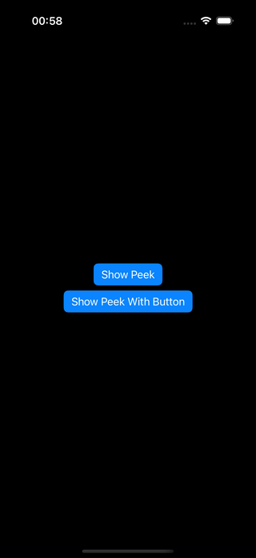

[](https://swiftpackageindex.com/cembaykara/PeekDialog)
[](https://swiftpackageindex.com/cembaykara/PeekDialog)

# 📦 PeekDialog

Toast and banner notifications for SwiftUI — iOS, macOS, watchOS, and visionOS.

Familiar bindings like `.sheet` / `.alert`, any view as content, swipe or auto-dismiss, and on iOS a stacked queue that sits **above everything** (including sheets).

<p align="center">
  
</p>

<p align="center">
  <a href="https://github.com/cembaykara/PeekDialog/wiki"><b>Wiki</b></a> ·
  <a href="https://github.com/cembaykara/PeekDialog/wiki/Getting-Started">Getting Started</a> ·
  <a href="https://github.com/cembaykara/PeekDialog/wiki/Custom-Styles">Custom Styles</a> ·
  <a href="https://github.com/cembaykara/PeekDialog/wiki/Common-Mistakes">Common Mistakes</a>
</p>

---

## ✨ Highlights

- 🎨 **Any content** — buttons, icons, custom layouts; it's just a SwiftUI view
- ⏳ **Auto-dismiss** — `.short` / `.medium` / `.long` or `.custom(seconds:)`
- 👆 **Swipe-to-dismiss** — on by default; disable with `.peekInteractiveDismissDisabled()`
- ✨ **Styles** — `.dialogStyle(.plain)` for full control, or glass on iOS 26+
- 🗂️ **Stacked notifications** *(iOS)* — `peekDialog(items:)` queues dialogs; top two stay visible
- 🪟 **Above everything** *(iOS)* — window-based presentation over sheets and alerts

---

## 🔧 Install

**Xcode:** *File → Add Package Dependencies…*

```
https://github.com/cembaykara/PeekDialog.git
```

**Package.swift:**

```swift
dependencies: [
    .package(url: "https://github.com/cembaykara/PeekDialog.git", from: "1.0.0")
]
```

---

## 🚀 Quick start

```swift
import SwiftUI
import PeekDialog

struct ContentView: View {
    @State private var showDialog = false

    var body: some View {
        Button("Show") { showDialog = true }
            .peekDialog(isPresented: $showDialog, dismissDelay: .medium) {
                HStack {
                    Image(systemName: "checkmark.circle.fill")
                        .foregroundColor(.green)
                    Text("Saved")
                    Spacer()
                }
                .padding()
            }
    }
}
```

Optional item binding (presents when non-`nil`):

```swift
.peekDialog(with: $errorMessage, dismissDelay: .long) { message in
    Label(message, systemImage: "exclamationmark.triangle.fill")
        .padding()
}
```

Duration & placement:

```swift
.peekDialog(isPresented: $show, dismissDelay: .custom(seconds: 1.25), placement: .bottom) {
    /* ... */
}
```

---

## 🗂️ Stacking *(iOS)*

Bind an array of `Identifiable` items. Up to two cards show; dismiss the front and the next slides in.

```swift
.peekDialog(items: $notifications, dismissDelay: .medium) { notification in
    Text(notification.message)
        .padding()
        .dialogStyle(.plain)
}
```

Tune the peek gap with `stackOffset` (default `12`). Full details in the [Stacking](https://github.com/cembaykara/PeekDialog/wiki/Stacking) wiki page.

---

## 🎨 Styling

`.dialogStyle` works like `.buttonStyle` — apply it **inside** the content closure.

```swift
.peekDialog(isPresented: $showDialog) {
    Text("Glass")
        .padding()
        .dialogStyle(.glassRegular)   // or .glassClear / .plain
}
```

Lock swipe the same way:

```swift
.peekDialog(isPresented: $showDialog, dismissDelay: .long) {
    HStack {
        Text("New message")
        Spacer()
        Button("View") { /* ... */ }
    }
    .padding()
    .peekInteractiveDismissDisabled()
}
```

One-off look with `.plain`, or a reusable `DialogStyle` — see [Custom Styles](https://github.com/cembaykara/PeekDialog/wiki/Custom-Styles).

> Modifiers like `.dialogStyle` / `.peekInteractiveDismissDisabled` **outside** the `peekDialog` closure are ignored. [Common Mistakes →](https://github.com/cembaykara/PeekDialog/wiki/Common-Mistakes)

---

## 🤝 Contributing

Issues and PRs welcome.

<a href='https://ko-fi.com/F1F719XC8H' target='_blank'></a>

## ⚖️ License

[Apache License 2.0](LICENSE.md)
